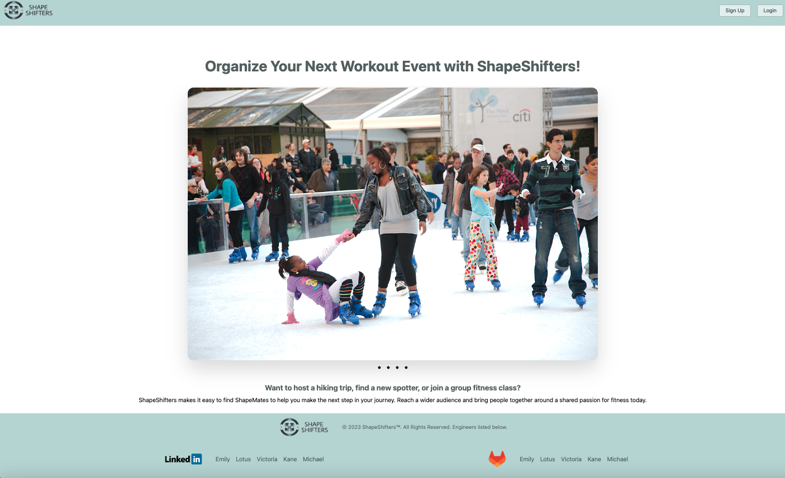

# ShapeShifters

**Team:** Emily Arai, Kane Rodriguez, Lotus McCrae, Michael Kane, Victoria Pratt

Want to host a hiking trip, find a new spotter, or join a group fitness class? ShapeShifters makes it easy to bring people together around a shared passion for fitness.

---

## Table of Contents

- [Intended Market](#intended-market)
- [Tech Stack](#tech-stack)
- [Features](#features)
- [Project Screenshots](#project-screenshots)
- [Getting Started](#getting-started)
- [Environment Variables](#environment-variables)
- [Docker Commands Reference](#docker-commands-reference)
- [API Reference](#api-reference)
- [Project Structure](#project-structure)
- [Database Schema](#database-schema)
- [Design Docs](#design-docs)

---

## Intended Market

ShapeShifters is designed for people who want to host or attend fitness events — and in doing so, meet others in their community who share a passion for an active lifestyle.

---

## Tech Stack

| Layer | Technology |
|---|---|
| Frontend | React 18, Redux Toolkit, RTK Query, React Router v6, Tailwind CSS |
| Backend | FastAPI, Python 3.10, jwtdown-fastapi |
| Database | PostgreSQL 15 |
| Auth | JWT (cookie-based) via jwtdown-fastapi |
| Geocoding | Radar API |
| Maps | Google Maps API |
| Containerization | Docker, Docker Compose |

---

## Features

- **Landing page** — A carousel of example fitness event photos visible to all visitors.
- **Sign up / Log in** — Account creation and login via modals in the navigation bar.
- **Browse events** — Logged-in users see a list of events in their geographic area.
- **Event detail** — Click any event to open a detail modal. Join with a single click.
- **Event map** — View the exact event location on an embedded Google Map.
- **Create event** — Fill in a form with event name, type, address, image URL, start/end dates, and a description. The address is geocoded automatically via the Radar API.
- **Your Events** — A tabbed page showing events the user is attending and events they are hosting.
- **Delete event** — Hosts can delete their own events from the "Hosting" tab.

---

## Project Screenshots




---

## Getting Started

### Prerequisites

- [Docker Desktop](https://www.docker.com/products/docker-desktop/)
- [OpenSSL](https://www.openssl.org/) (for generating a signing key)
- A [Google Maps API key](https://developers.google.com/maps/documentation/javascript/cloud-setup)

### Setup

1. **Clone the repository**

   ```bash
   git clone <repo-url>
   cd shapeshifters
   ```

2. **Generate a signing key**

   ```bash
   openssl rand -hex 32
   ```

3. **Create a `.env` file** in the project root (see [Environment Variables](#environment-variables) below)

4. **Open Docker Desktop**

5. **Create the database volume**

   ```bash
   docker volume create shapeshifters-data
   ```

6. **Build and start the application**

   ```bash
   docker compose -f docker-compose-dev.yaml up --build
   ```

   Services will be available at:
   - Frontend: http://localhost:3000
   - Backend API: http://localhost:8000
   - API docs (Swagger): http://localhost:8000/docs
   - PostgreSQL: localhost:15432

7. **Seed the database with sample data**

   In a separate terminal, open a shell inside the FastAPI container:

   ```bash
   docker exec -it shapeshifters-fastapi-1 bash
   ```

   Then inside the container, run the seed script:

   ```bash
   python db_script.py
   ```

   Then exit the shell:

   ```bash
   exit
   ```

8. **Stop the application**

   ```bash
   docker compose -f docker-compose-dev.yaml down
   ```

---

## Environment Variables

Create a `.env` file in the project root with the following variables:

```env
SIGNING_KEY=<output of: openssl rand -hex 32>
REACT_APP_GOOGLE_API_KEY=<your Google Maps API key>
```

| Variable | Description |
|---|---|
| `SIGNING_KEY` | 64-character hex string used to sign JWTs |
| `REACT_APP_GOOGLE_API_KEY` | Google Maps key used for the event map modal |

---

## Docker Commands Reference

| Task | Command |
|---|---|
| Start the app | `docker compose -f docker-compose-dev.yaml up --build` |
| Stop the app | `docker compose -f docker-compose-dev.yaml down` |
| Stop and delete database | `docker compose -f docker-compose-dev.yaml down` then `docker volume rm shapeshifters-data` |
| Open a shell in the API container | `docker exec -it shapeshifters-fastapi-1 bash` |
| Seed the database | (inside container) `python db_script.py` |
| Recreate the database volume | `docker volume create shapeshifters-data` |

> **Note:** The database volume is declared `external: true` in the compose file. Using `docker compose down -v` will **not** remove it. You must run `docker volume rm shapeshifters-data` manually to delete the database.

---

## API Reference

The FastAPI backend auto-generates interactive documentation at **http://localhost:8000/docs**.

### Authentication

| Method | Endpoint | Description | Auth Required |
|---|---|---|---|
| POST | `/token` | Log in (returns JWT cookie) | No |
| DELETE | `/token` | Log out | No |
| GET | `/token` | Get current account info | No |

### Accounts

| Method | Endpoint | Description | Auth Required |
|---|---|---|---|
| POST | `/api/accounts` | Create a new account | No |

**POST `/api/accounts` — Request body:**
```json
{
  "first_name": "string",
  "last_name": "string",
  "zip_code": "string",
  "email": "string",
  "hashed_password": "string"
}
```

### Events

| Method | Endpoint | Description | Auth Required |
|---|---|---|---|
| GET | `/api/events` | Get all events | No |
| POST | `/api/events` | Create an event | Yes |
| GET | `/api/events/{event_id}` | Get a single event | No |
| PUT | `/api/events/{event_id}` | Update an event | Yes |
| DELETE | `/api/events/{event_id}` | Delete an event | Yes |
| GET | `/api/events/hosting` | Get events the current user hosts | Yes |
| GET | `/api/events/attending` | Get events the current user attends | Yes |

**POST/PUT `/api/events` — Request body:**
```json
{
  "event_name": "string",
  "event_type": "string",
  "address_line1": "string",
  "address_line2": "string",
  "city": "string",
  "state": "string",
  "zip_code": "string",
  "country": "string",
  "image_url": "string",
  "start_datetime": "2024-01-01T09:00:00",
  "end_datetime": "2024-01-01T11:00:00",
  "event_description": "string"
}
```

> Latitude and longitude are resolved automatically from the address via the Radar API.

### Attendees

| Method | Endpoint | Description | Auth Required |
|---|---|---|---|
| POST | `/api/events/{event_id}/attendees` | Join an event | Yes |
| DELETE | `/api/events/{event_id}/attendees/{attendee_id}` | Leave an event | Yes |

---

## Project Structure

```
shapeshifters/
├── api/                          # FastAPI backend
│   ├── main.py                   # App entry point, router registration, CORS config
│   ├── authenticator.py          # Custom JWT authenticator
│   ├── db_script.py              # Database seed script
│   ├── database.py               # Sample users and events data
│   ├── requirements.txt
│   ├── Dockerfile
│   ├── Dockerfile.dev
│   ├── routers/
│   │   ├── accounts.py           # Account endpoints
│   │   ├── events.py             # Event endpoints
│   │   └── attendees.py         # Attendee endpoints
│   ├── queries/
│   │   ├── accounts.py           # Account DB queries
│   │   ├── events.py             # Event DB queries (includes Radar geocoding)
│   │   └── attendees.py         # Attendee DB queries
│   ├── models/
│   │   ├── accounts.py           # Account Pydantic schemas
│   │   ├── events.py             # Event Pydantic schemas
│   │   └── attendees.py         # Attendee Pydantic schemas
│   ├── migrations/
│   │   └── 001_initial.py        # DB schema: users, events, attendees tables
│   └── tests/
├── ghi/                          # React frontend
│   ├── src/
│   │   ├── App.js                # Routes
│   │   ├── components/
│   │   │   ├── Nav.js            # Navigation bar
│   │   │   ├── LandingPage.js    # Landing page with carousel
│   │   │   ├── EventsPage.js     # Main events list page
│   │   │   ├── EventsPageTabs.js # Attending / Hosting tab switcher
│   │   │   ├── EventDetails.js   # Event detail modal
│   │   │   ├── EventMap.js       # Google Maps modal
│   │   │   ├── EventCard.js      # Individual event card
│   │   │   ├── EventsCards.js    # All events list
│   │   │   ├── EventsAttendingCards.js
│   │   │   ├── EventsHostingCards.js
│   │   │   ├── EventForm.js      # Create event modal form
│   │   │   ├── Login.js          # Login modal
│   │   │   ├── Signup.js         # Signup modal
│   │   │   ├── Logout.js
│   │   │   ├── Footer.js
│   │   │   └── Modal.js          # Generic modal wrapper
│   │   ├── store/
│   │   │   └── store.js          # Redux store configuration
│   │   ├── features/             # Redux slices
│   │   └── services/
│   │       ├── auth.js           # RTK Query: auth endpoints
│   │       ├── events.js         # RTK Query: event endpoints
│   │       └── attendees.js      # RTK Query: attendee endpoints
│   ├── tailwind.config.js
│   └── package.json
├── docs/
│   └── RestfulAPIs.md            # API design documentation
├── readme_imgs/                  # Screenshots used in this README
├── docker-compose.yaml
├── docker-compose-dev.yaml
└── .env                          # Local environment variables (do not commit)
```

---

## Database Schema

### `users`
| Column | Type | Notes |
|---|---|---|
| id | SERIAL | Primary key |
| first_name | VARCHAR(100) | |
| last_name | VARCHAR(100) | |
| zip_code | VARCHAR(10) | |
| email | VARCHAR(100) | Unique |
| hashed_password | VARCHAR(100) | bcrypt hashed |

### `events`
| Column | Type | Notes |
|---|---|---|
| id | SERIAL | Primary key |
| host_id | INT | Foreign key → users.id |
| event_name | VARCHAR(250) | |
| event_type | VARCHAR(100) | |
| image_url | VARCHAR(500) | |
| start_datetime | TIMESTAMP | |
| end_datetime | TIMESTAMP | |
| address_line1 | VARCHAR(250) | |
| address_line2 | VARCHAR(250) | Optional |
| city | VARCHAR(100) | |
| state | VARCHAR(100) | |
| zip_code | VARCHAR(100) | |
| country | VARCHAR(100) | |
| lat | DECIMAL(9,6) | Resolved via Radar API |
| lon | DECIMAL(9,6) | Resolved via Radar API |
| event_description | TEXT | |

### `attendees`
| Column | Type | Notes |
|---|---|---|
| id | SERIAL | Primary key |
| user_id | INT | Foreign key → users.id |
| event_id | INT | Foreign key → events.id |

---

## Design Docs

- [API Design](docs/RestfulAPIs.md)
