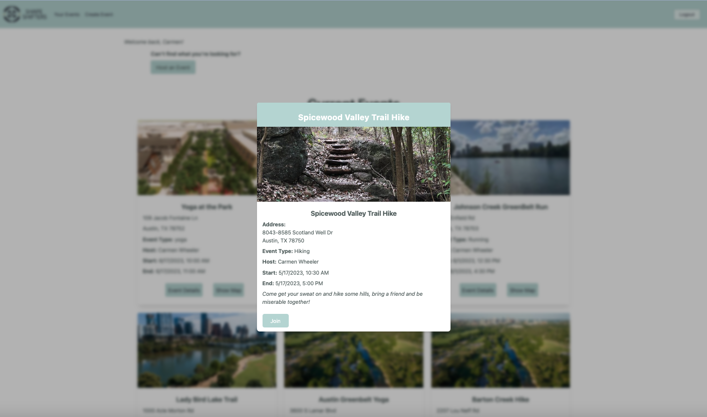
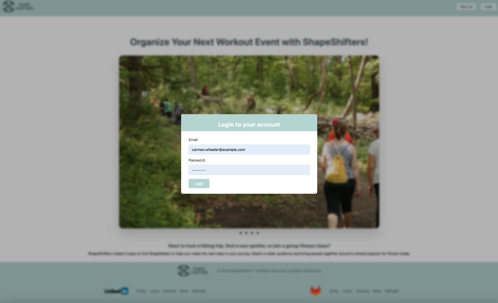
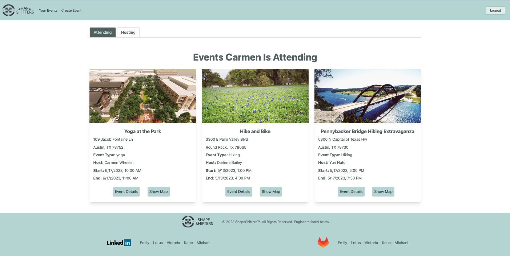
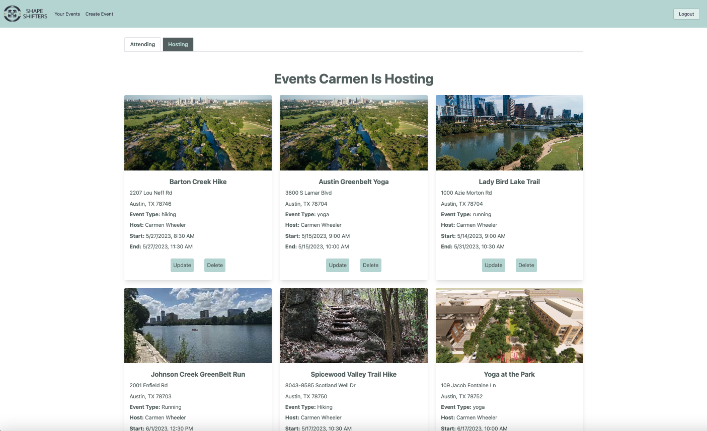
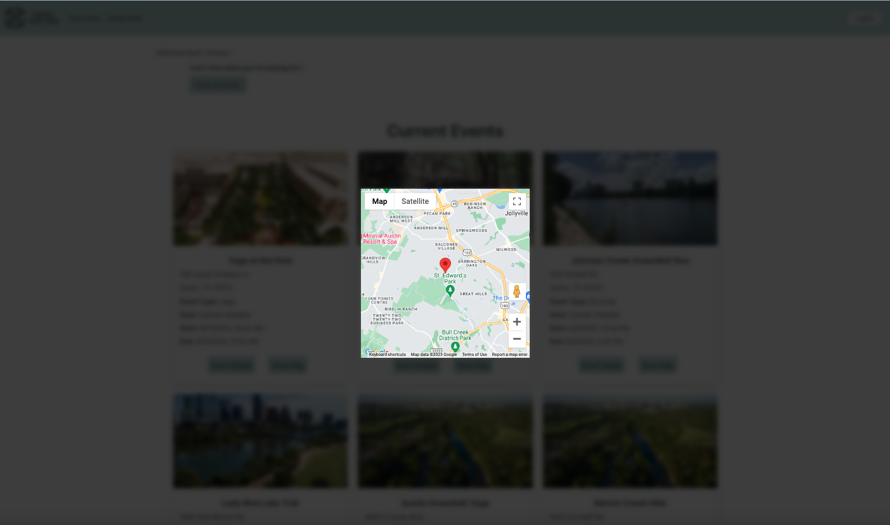

## ShapeShifters

- Emily Arai
- Kane Rodriguez
- Lotus McCrae
- Michael Kane
- Victoria Pratt

Want to host a hiking trip, find a new spotter, or join a group fitness class? ShapeShifters makes it easy to bring people together around a shared passion for fitness.

## Design

- [API design](docs/RestfulAPIs.md)

## Intended market

This application is designed for people who want to host or attend fitness events, and in doing so, meet others in their community who are also interested in fitness.

## Functionality

- Upon visiting the home page, users can see a carousel of example photos that they may click through to see the various types of events that they could host or attend on the website.
- Users can opt to sign up for a ShapeShifters account, or log in to their account via the buttons on the navigation bar at the top of the page.
- Logged in users will see a list of events that are in their geographical area.
- Clicking on an event will open a window for the event's details, and users may join the event by clicking the "Join" button.
- Logged in users will also see a "Your Events" link and a "Create Event" link in the navigation bar.
- "Create Event" will open a form that the user can fill in and submit to host a new event.
    - In the form, hosts will be able to enter an event name, an event type, an address for the event, an image url, a start and end date, and a description of the event.
- "Your Events" will take users to a page that shows the events they are attending and hosting, depending on whether the "Attending" or "Hosting" tab is selected on the page.
- Events under the "Hosting" tab will each display a "Delete" button that the host can click to delete the event.

## Project Images
")

## Project Initialization

How to use this application locally:

1. Clone this repository to your local machine
2. CD into the new directory
3. Obtain a Radar Api Key (https://radar.com/product/api)
4. Obtain a Google Maps Api key (https://developers.google.com/maps/documentation/javascript/cloud-setup).
5. Make Signing Key
    - install openssl
    - run openssl rand -hex 32
6. Make a .env file with the following variables:
    - SIGNING_KEY set to the random string generated when Signing Key is created
    - RADAR_API_KEY set to the Radar Api Key
    - REACT_APP_GOOGLE_API_KEY  set to Google Maps Api Key
7. Run `docker volume create shapeshifters-data`
8. Run `docker compose -f docker-compose-dev.yaml up --build`
9. Run `docker exec -it shapeshifters-fastapi-1 bash`
10. To end, run `docker compose -f docker-compose.dev.yml down`

If you want to remove all named volumes declared in the compose file along with anonymous volumes attached to containers, run `docker compose -f docker-compose.dev.yml down -v`. You will have to rerun Step 7 the next time you wish to use this application locally.
